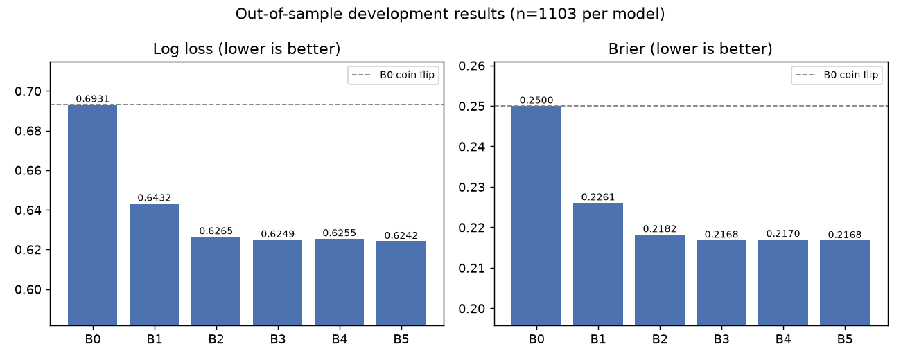
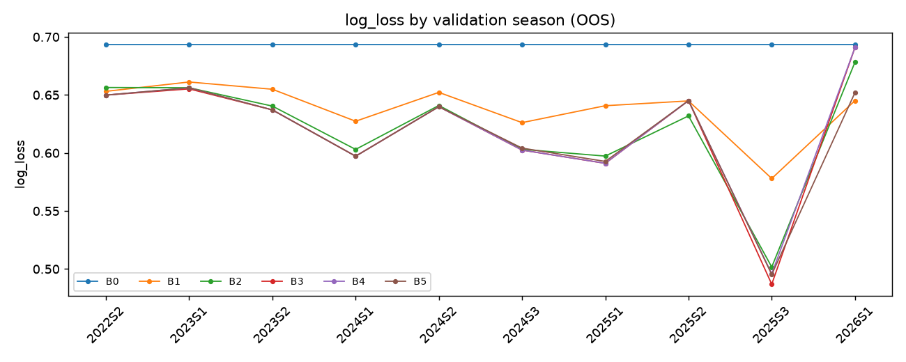
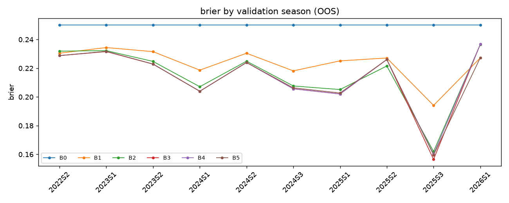
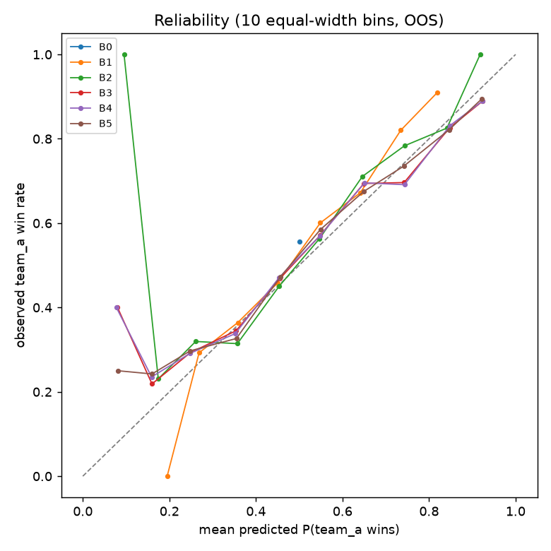
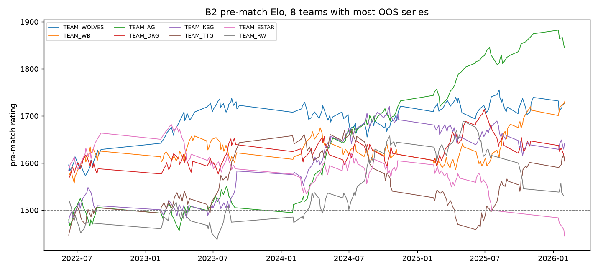

# OpenKPL Temporal Benchmark (v0.3 Phase B)

Generated 2026-09-28T11:27:42Z | benchmark 0.3.0-phaseB | git commit: not available (not a git repository)

No final model is selected in this report. Model freeze is a separate, explicit step (`openkpl freeze`).

## 1. Executive summary

- Out-of-sample (OOS) predictions: 1103 completed series per model across 10 season-level expanding-window folds (KPL2022S2 to KPL2026S1).
- Lowest OOS log loss: B5 (0.6242); lowest OOS Brier: B5 (0.2168). B0 coin flip: log loss 0.6931, Brier 0.2500.
- Log loss ranking: B5 < B3 < B4 < B2 < B1 < B0. Brier ranking: B5 < B3 < B4 < B2 < B1 < B0.
- Paired per-series log-loss differences exceeding 2 naive standard errors: B1 - B0 (-0.0499), B2 - B1 (-0.0167).
- The first-listed team (team_a) won 55.7% of OOS series. No model here uses side/order information, so all models are symmetric in team_a/team_b.
- Prospective holdout (start_time >= 2026-09-28 00:00:00): 0 labeled rows present; none were used.

## 2. Data universe

- Source: `PythonMajor-assignment/data/kpl_data.db` (sha256 `8f9631274e2b9189...`), via `data/processed/temporal/canonical_series.parquet`. The WZRY draft corpus is not used and not joined.
- Development rule: `is_label_eligible AND start_time < prospective_holdout_start`; 1239 series from 2022-02-09 15:00:00 to 2026-02-01 20:00:00.
- Validation (OOS) seasons: KPL2022S2, KPL2023S1, KPL2023S2, KPL2024S1, KPL2024S2, KPL2024S3, KPL2025S1, KPL2025S2, KPL2025S3, KPL2026S1. Training-only seasons: KPL2022S1. Excluded seasons: none.
- Labels: status == 4 with a decisive series score and both teams resolved. Scheduled or unfinished series are never labels.

## 3. Identity resolution

- Observed names are mapped to canonical team IDs using VERIFIED rows of `data/dimensions/team_identity_registry.csv`; raw names are kept as `raw_team_a` / `raw_team_b`.
- Multi-name canonical teams: TEAM_HERO, TEAM_DRG, TEAM_LGD_NBW, TEAM_MTG, TEAM_QINGJIU, TEAM_TCG, TEAM_KSG (KSG is a SOURCE_ALIAS, not a verified rebrand). All other names are one-to-one.
- League-slot continuity (厦门VG -> 北京JDG) is stored separately in `team_season_membership.csv` and does not affect B0-B5. See `canonicalization_audit.csv` for resolution counts and checks.

## 4. Known coverage gaps

- No series before 2022-02-09 in source: 2020-2021 seasons are not covered.
- KPL2022S3 (annual finals) is not in the source.
- KPL2023S3 (annual finals) is not in the source.
- No series after 2026-03-01 in source; any later competition is not covered (its existence is not asserted here).
- KPL2026S1: 45 of 90 scheduled series have labels; 45 unplayed/unfinished at crawl time are not labels (flags: NOT_FINISHED, STATUS_SCORE_CONFLICT).
- Timezone: UNVERIFIED. start_time is naive, converted by the crawler with datetime.fromtimestamp in an unrecorded local time zone. Ordering is valid if the offset is constant (DST in the crawler zone could shift some times by 1h). INFERENCE only: series start at 14:00-20:00 and the one in-progress series (14:00 start, 2-0) was crawled at update_time 07:40, consistent with start_time in China Standard Time and update_time in UTC.
- Missing seasons are not imputed. Ratings carry across gaps as if no matches occurred.

## 5. Temporal validation design

- Season-level expanding window: fold f trains on every development series before the start of validation season v_f and validates on v_f. Within a fold, models still predict online (each series from data strictly before its timestamp), so validation-season results also update ratings for later validation series. This is standard for sequential rating systems; no validation label is used before its own prediction.
- Same-timestamp series are predicted as a batch from the pre-timestamp state, then updated together. (The current source has no shared timestamps among completed series; the logic is tested on synthetic data.)
- Nested tuning: for fold f, each configuration is run online over training rows only (start_time < validation start) and scored on those one-step-ahead predictions; the best configuration is then applied to the validation season.

| fold_id | train_seasons | validation_season | n_train | n_validation | coverage_warning |
|---|---|---|---|---|---|
| F01 | KPL2022S1 | KPL2022S2 | 136 | 136 | SINGLE_SEASON_TRAINING: inner tuning window has no season transition |
| F02 | KPL2022S1|KPL2022S2 | KPL2023S1 | 272 | 136 | PRECEDING_ANNUAL_FINALS_NOT_IN_SOURCE: KPL2022S3 missing |
| F03 | KPL2022S1|KPL2022S2|KPL2023S1 | KPL2023S2 | 408 | 136 |  |
| F04 | KPL2022S1|KPL2022S2|KPL2023S1|KPL2023S2 | KPL2024S1 | 544 | 136 | PRECEDING_ANNUAL_FINALS_NOT_IN_SOURCE: KPL2023S3 missing |
| F05 | KPL2022S1|KPL2022S2|KPL2023S1|KPL2023S2|KPL2024S1 | KPL2024S2 | 680 | 136 |  |
| F06 | KPL2022S1|KPL2022S2|KPL2023S1|KPL2023S2|KPL2024S1|KPL2024S2 | KPL2024S3 | 816 | 53 | ANNUAL_FINALS_SUBSET: 12 of 18 teams, different format |
| F07 | KPL2022S1|KPL2022S2|KPL2023S1|KPL2023S2|KPL2024S1|KPL2024S2|KPL2024S3 | KPL2025S1 | 869 | 136 |  |
| F08 | KPL2022S1|KPL2022S2|KPL2023S1|KPL2023S2|KPL2024S1|KPL2024S2|KPL2024S3|KPL2025S1 | KPL2025S2 | 1005 | 136 |  |
| F09 | KPL2022S1|KPL2022S2|KPL2023S1|KPL2023S2|KPL2024S1|KPL2024S2|KPL2024S3|KPL2025S1|KPL2025S2 | KPL2025S3 | 1141 | 53 | ANNUAL_FINALS_SUBSET: 12 of 18 teams, different format |
| F10 | KPL2022S1|KPL2022S2|KPL2023S1|KPL2023S2|KPL2024S1|KPL2024S2|KPL2024S3|KPL2025S1|KPL2025S2|KPL2025S3 | KPL2026S1 | 1194 | 45 | PARTIAL_SEASON: 45 of 90 scheduled series labeled |

## 6. Model definitions

| model | mechanism |
|---|---|
| B0 | Constant P(team_a)=0.5 |
| B1 | Team history: expanding Beta(5,5)-smoothed win rate, combined by log5 |
| B2 | Sequential Elo dynamics on canonical IDs (K=24, scale=400, untuned) |
| B3 | Nested temporal tuning of K and scale |
| B4 | Inactivity regression to 1500 with tuned half-life (K tuned jointly, scale 400) |
| B5 | Season-start regression to 1500 with tuned rho (K tuned jointly, scale 400; no decay) |

Formulas: Elo P(A) = 1 / (1 + 10^((R_B - R_A)/scale)), R <- R + K(y - P), new teams at 1500. B4: R_pre(t) = 1500 + (R - 1500) * 2^(-(t - t_last)/h). B5: at each new season label, R <- 1500 + rho (R - 1500). B1: s = (w + 5)/(n + 10), combined by log5.

## 7. Hyperparameter selection

- Objective: log_loss (mean, probabilities clipped to [1e-6, 1-1e-6]). Tie-break: log loss rounded to 1e-10, then Brier rounded to 1e-10, then closeness to the untuned default (K=24, scale=400, rho=1, half_life=inf); remaining exact ties by sorted parameter tuple.
- Elo probabilities depend on K and scale only through K/scale; equivalent pairs tie exactly and are resolved by closeness to scale=400.
- Fold F01 inner window is a single season: rho (B5) is not identifiable there and falls back to the tie-break (rho=1).

Fold-level selections (inner data strictly before validation start):

| model | fold | validation | selected | inner_n | inner_log_loss | tied |
|---|---|---|---|---|---|---|
| B3 | F01 | KPL2022S2 | k=40.0, scale=400.0 | 136 | 0.6749 | 2 |
| B3 | F02 | KPL2023S1 | k=32.0, scale=300.0 | 272 | 0.6622 | 2 |
| B3 | F03 | KPL2023S2 | k=40.0, scale=400.0 | 408 | 0.6599 | 2 |
| B3 | F04 | KPL2024S1 | k=40.0, scale=400.0 | 544 | 0.6542 | 2 |
| B3 | F05 | KPL2024S2 | k=40.0, scale=400.0 | 680 | 0.6428 | 2 |
| B3 | F06 | KPL2024S3 | k=40.0, scale=400.0 | 816 | 0.6423 | 2 |
| B3 | F07 | KPL2025S1 | k=40.0, scale=400.0 | 869 | 0.6399 | 2 |
| B3 | F08 | KPL2025S2 | k=40.0, scale=400.0 | 1005 | 0.6333 | 2 |
| B3 | F09 | KPL2025S3 | k=24.0, scale=300.0 | 1141 | 0.6344 | 4 |
| B3 | F10 | KPL2026S1 | k=40.0, scale=400.0 | 1194 | 0.6277 | 2 |
| B4 | F01 | KPL2022S2 | k=40.0, half_life_days=inf | 136 | 0.6749 | 1 |
| B4 | F02 | KPL2023S1 | k=48.0, half_life_days=inf | 272 | 0.6622 | 1 |
| B4 | F03 | KPL2023S2 | k=40.0, half_life_days=inf | 408 | 0.6599 | 1 |
| B4 | F04 | KPL2024S1 | k=40.0, half_life_days=inf | 544 | 0.6542 | 1 |
| B4 | F05 | KPL2024S2 | k=40.0, half_life_days=inf | 680 | 0.6428 | 1 |
| B4 | F06 | KPL2024S3 | k=40.0, half_life_days=inf | 816 | 0.6423 | 1 |
| B4 | F07 | KPL2025S1 | k=40.0, half_life_days=inf | 869 | 0.6399 | 1 |
| B4 | F08 | KPL2025S2 | k=40.0, half_life_days=inf | 1005 | 0.6333 | 1 |
| B4 | F09 | KPL2025S3 | k=40.0, half_life_days=730.0 | 1141 | 0.6342 | 1 |
| B4 | F10 | KPL2026S1 | k=40.0, half_life_days=inf | 1194 | 0.6277 | 1 |
| B5 | F01 | KPL2022S2 | k=40.0, rho=1.0 | 136 | 0.6749 | 9 |
| B5 | F02 | KPL2023S1 | k=48.0, rho=1.0 | 272 | 0.6622 | 1 |
| B5 | F03 | KPL2023S2 | k=40.0, rho=1.0 | 408 | 0.6599 | 1 |
| B5 | F04 | KPL2024S1 | k=40.0, rho=1.0 | 544 | 0.6542 | 1 |
| B5 | F05 | KPL2024S2 | k=40.0, rho=1.0 | 680 | 0.6428 | 1 |
| B5 | F06 | KPL2024S3 | k=40.0, rho=0.9 | 816 | 0.6420 | 1 |
| B5 | F07 | KPL2025S1 | k=40.0, rho=0.9 | 869 | 0.6397 | 1 |
| B5 | F08 | KPL2025S2 | k=40.0, rho=1.0 | 1005 | 0.6333 | 1 |
| B5 | F09 | KPL2025S3 | k=40.0, rho=0.9 | 1141 | 0.6336 | 1 |
| B5 | F10 | KPL2026S1 | k=48.0, rho=0.9 | 1194 | 0.6275 | 1 |

Final development-selected values (all development data; candidates for freeze only):

- B0: (no parameters)
- B1: alpha=5.0, beta=5.0
- B2: k=24.0, scale=400.0
- B3: k=40.0, scale=400.0
- B4: k=48.0, half_life_days=730.0
- B5: k=40.0, rho=0.9

## 8. Overall OOS results

| model_id | n | log_loss | brier | accuracy | roc_auc | ece | calibration_intercept | calibration_slope | mean_predicted_p | observed_win_rate |
|---|---|---|---|---|---|---|---|---|---|---|
| B0 | 1103 | 0.6931 | 0.2500 | 0.5567 | 0.5000 | 0.0567 | 0.2276 | NA | 0.5000 | 0.5567 |
| B1 | 1103 | 0.6432 | 0.2261 | 0.6337 | 0.6711 | 0.0325 | 0.1370 | 1.2023 | 0.5249 | 0.5567 |
| B2 | 1103 | 0.6265 | 0.2182 | 0.6528 | 0.7013 | 0.0326 | 0.0838 | 1.0767 | 0.5380 | 0.5567 |
| B3 | 1103 | 0.6249 | 0.2168 | 0.6564 | 0.7059 | 0.0300 | 0.0520 | 0.8706 | 0.5457 | 0.5567 |
| B4 | 1103 | 0.6255 | 0.2170 | 0.6555 | 0.7052 | 0.0321 | 0.0534 | 0.8656 | 0.5454 | 0.5567 |
| B5 | 1103 | 0.6242 | 0.2168 | 0.6573 | 0.7052 | 0.0277 | 0.0647 | 0.9147 | 0.5429 | 0.5567 |



Paired per-series differences (negative = first model better). SE assumes independent series and is therefore optimistic:

| comparison | n | mean_d_log_loss | se_d_log_loss | mean_d_brier | se_d_brier | log_loss_diff_over_2se |
|---|---|---|---|---|---|---|
| B1 - B0 | 1103 | -0.04991 | 0.00746 | -0.02392 | 0.00354 | 1 |
| B2 - B1 | 1103 | -0.01674 | 0.00470 | -0.00785 | 0.00204 | 1 |
| B3 - B2 | 1103 | -0.00155 | 0.00303 | -0.00138 | 0.00115 | 0 |
| B4 - B3 | 1103 | 0.00054 | 0.00053 | 0.00020 | 0.00022 | 0 |
| B5 - B3 | 1103 | -0.00079 | 0.00150 | -0.00009 | 0.00053 | 0 |
| B5 - B4 | 1103 | -0.00133 | 0.00141 | -0.00029 | 0.00049 | 0 |

## 9. Season-by-season results

Log loss:

| validation_season | B0 | B1 | B2 | B3 | B4 | B5 |
|---|---|---|---|---|---|---|
| KPL2022S2 | 0.6931 | 0.6531 | 0.6564 | 0.6498 | 0.6498 | 0.6498 |
| KPL2023S1 | 0.6931 | 0.6611 | 0.6562 | 0.6552 | 0.6561 | 0.6561 |
| KPL2023S2 | 0.6931 | 0.6549 | 0.6404 | 0.6371 | 0.6371 | 0.6371 |
| KPL2024S1 | 0.6931 | 0.6273 | 0.6031 | 0.5972 | 0.5972 | 0.5972 |
| KPL2024S2 | 0.6931 | 0.6522 | 0.6409 | 0.6399 | 0.6399 | 0.6399 |
| KPL2024S3 | 0.6931 | 0.6261 | 0.6031 | 0.6025 | 0.6025 | 0.6042 |
| KPL2025S1 | 0.6931 | 0.6407 | 0.5973 | 0.5911 | 0.5911 | 0.5927 |
| KPL2025S2 | 0.6931 | 0.6448 | 0.6319 | 0.6451 | 0.6451 | 0.6451 |
| KPL2025S3 | 0.6931 | 0.5780 | 0.5017 | 0.4869 | 0.4959 | 0.4953 |
| KPL2026S1 | 0.6931 | 0.6451 | 0.6782 | 0.6908 | 0.6908 | 0.6520 |

Brier:

| validation_season | B0 | B1 | B2 | B3 | B4 | B5 |
|---|---|---|---|---|---|---|
| KPL2022S2 | 0.2500 | 0.2305 | 0.2319 | 0.2288 | 0.2288 | 0.2288 |
| KPL2023S1 | 0.2500 | 0.2344 | 0.2322 | 0.2316 | 0.2317 | 0.2317 |
| KPL2023S2 | 0.2500 | 0.2315 | 0.2247 | 0.2229 | 0.2229 | 0.2229 |
| KPL2024S1 | 0.2500 | 0.2187 | 0.2071 | 0.2040 | 0.2040 | 0.2040 |
| KPL2024S2 | 0.2500 | 0.2304 | 0.2249 | 0.2240 | 0.2240 | 0.2240 |
| KPL2024S3 | 0.2500 | 0.2182 | 0.2076 | 0.2056 | 0.2056 | 0.2063 |
| KPL2025S1 | 0.2500 | 0.2251 | 0.2051 | 0.2020 | 0.2020 | 0.2027 |
| KPL2025S2 | 0.2500 | 0.2271 | 0.2216 | 0.2261 | 0.2261 | 0.2261 |
| KPL2025S3 | 0.2500 | 0.1941 | 0.1620 | 0.1565 | 0.1601 | 0.1596 |
| KPL2026S1 | 0.2500 | 0.2272 | 0.2366 | 0.2367 | 0.2367 | 0.2274 |

Seasons where every Elo variant (B2-B5) has higher log loss than B0: none.




## 10. Calibration analysis

| model_id | ece | calibration_intercept | calibration_slope | sd_p | min_p | max_p | share_p_in_0.4_0.6 | reading |
|---|---|---|---|---|---|---|---|---|
| B0 | 0.0567 | 0.2276 | NA | 0.0000 | 0.5000 | 0.5000 | 1.0000 | slope undefined (constant predictions); calibration-in-the-large offset +0.228 (positive = team_a wins more often than predicted) |
| B1 | 0.0325 | 0.1370 | 1.2023 | 0.1283 | 0.1920 | 0.8564 | 0.5005 | under-confident / compressed (slope > 1.2); calibration-in-the-large offset +0.137 (positive = team_a wins more often than predicted) |
| B2 | 0.0326 | 0.0838 | 1.0767 | 0.1605 | 0.0953 | 0.9411 | 0.4461 | slope within [0.8, 1.2] |
| B3 | 0.0300 | 0.0520 | 0.8706 | 0.1912 | 0.0609 | 0.9693 | 0.3645 | slope within [0.8, 1.2] |
| B4 | 0.0321 | 0.0534 | 0.8656 | 0.1914 | 0.0609 | 0.9693 | 0.3690 | slope within [0.8, 1.2] |
| B5 | 0.0277 | 0.0647 | 0.9147 | 0.1849 | 0.0686 | 0.9693 | 0.3762 | slope within [0.8, 1.2] |

Season-level instability (B2-B5 rows with slope outside [0.5, 1.5] or ECE > 0.10):

| model_id | season | n | ece | calibration_intercept | calibration_slope |
|---|---|---|---|---|---|
| B2 | KPL2022S2 | 136 | 0.0569 | 0.2220 | 1.7597 |
| B2 | KPL2024S3 | 53 | 0.1024 | 0.1118 | 1.0896 |
| B2 | KPL2025S2 | 136 | 0.1063 | -0.0203 | 0.8261 |
| B2 | KPL2025S3 | 53 | 0.1623 | 0.7446 | 1.6411 |
| B2 | KPL2026S1 | 45 | 0.1859 | -0.0364 | 0.5200 |
| B3 | KPL2023S1 | 136 | 0.1143 | -0.1093 | 0.7883 |
| B3 | KPL2024S3 | 53 | 0.1287 | -0.0009 | 0.8588 |
| B3 | KPL2025S3 | 53 | 0.1323 | 0.6729 | 1.5452 |
| B3 | KPL2026S1 | 45 | 0.1623 | -0.0359 | 0.4638 |
| B4 | KPL2023S1 | 136 | 0.1108 | -0.1097 | 0.7433 |
| B4 | KPL2024S3 | 53 | 0.1287 | -0.0009 | 0.8588 |
| B4 | KPL2025S3 | 53 | 0.1280 | 0.6819 | 1.7407 |
| B4 | KPL2026S1 | 45 | 0.1623 | -0.0359 | 0.4638 |
| B5 | KPL2023S1 | 136 | 0.1108 | -0.1097 | 0.7433 |
| B5 | KPL2024S3 | 53 | 0.1351 | 0.0992 | 0.9908 |
| B5 | KPL2025S3 | 53 | 0.1422 | 0.6770 | 1.7460 |
| B5 | KPL2026S1 | 45 | 0.1306 | -0.0148 | 0.6166 |



Raw-model diagnostics only; no post-hoc recalibration is applied.

## 11. Ablation findings

| model | features_or_mechanism_added | log_loss | delta_log_loss_vs_previous | brier | delta_brier_vs_previous | notes |
|---|---|---|---|---|---|---|
| B0 | Constant P(team_a)=0.5 | 0.69315 | NA | 0.25000 | NA | reference rung |
| B1 | Team history: expanding Beta(5,5)-smoothed win rate, combined by log5 | 0.64324 | -0.04991 | 0.22608 | -0.02392 | vs B0: log loss improved, Brier improved |
| B2 | Sequential Elo dynamics on canonical IDs (K=24, scale=400, untuned) | 0.62650 | -0.01674 | 0.21823 | -0.00785 | vs B1: log loss improved, Brier improved |
| B3 | Nested temporal tuning of K and scale | 0.62495 | -0.00155 | 0.21685 | -0.00138 | vs B2: log loss improved, Brier improved |
| B4 | Inactivity regression to 1500 with tuned half-life (K tuned jointly, scale 400) | 0.62549 | 0.00054 | 0.21705 | 0.00020 | vs B3: log loss worsened, Brier worsened; vs B3 (its actual base): d_log_loss=+0.00054, d_brier=+0.00020 |
| B5 | Season-start regression to 1500 with tuned rho (K tuned jointly, scale 400; no decay) | 0.62416 | -0.00133 | 0.21676 | -0.00029 | vs B4: log loss improved, Brier improved; vs B3 (its actual base): d_log_loss=-0.00079, d_brier=-0.00009 |

## 12. Slot-continuity experiment (E_SLOT, not part of B0-B5)

Status: **INSUFFICIENT EVIDENCE** (1 usable slot example(s): TEAM_VG->TEAM_JDG; minimum 5). Lambda grid [0.0, 0.25, 0.5, 0.75, 1.0].

| lambda_slot | n_oos | oos_log_loss | oos_brier | n_affected | affected_log_loss | affected_brier | delta_affected_log_loss_vs_lambda0 |
|---|---|---|---|---|---|---|---|
| 0.00000 | 1103 | 0.62495 | 0.21685 | 10 | 0.61343 | 0.21696 | 0.00000 |
| 0.25000 | 1103 | 0.62464 | 0.21668 | 10 | 0.56742 | 0.19602 | -0.04601 |
| 0.50000 | 1103 | 0.62446 | 0.21656 | 10 | 0.52991 | 0.17930 | -0.08352 |
| 0.75000 | 1103 | 0.62441 | 0.21651 | 10 | 0.50069 | 0.16682 | -0.11274 |
| 1.00000 | 1103 | 0.62450 | 0.21652 | 10 | 0.47951 | 0.15834 | -0.13392 |

No best lambda is claimed. The affected rows are the successor team's series in its first season.

## 13. Failure cases

Ten highest-loss OOS predictions for B5 (lowest overall log loss excluding B0):

| series_id | season | stage | canonical_team_a_id | canonical_team_b_id | predicted_p_team_a | actual_team_a_win |
|---|---|---|---|---|---|---|
| KPL2024S2M3W5D1 | KPL2024S2 | 常规赛第一轮 | TEAM_KSG | TEAM_WE | 0.9218 | 0 |
| KPL2025S2M7W3D3 | KPL2025S2 | 常规赛第二轮 | TEAM_AG | TEAM_TTG | 0.9217 | 0 |
| KPL2024S1M3W4D1 | KPL2024S1 | 常规赛第一轮 | TEAM_VG | TEAM_TTG | 0.0905 | 1 |
| KPL2026S1M1W1D2 | KPL2026S1 | 常规赛第一轮 | TEAM_DYG | TEAM_WOLVES | 0.1073 | 1 |
| KPL2024S2M6W2D2 | KPL2024S2 | 常规赛第二轮 | TEAM_WOLVES | TEAM_WE | 0.8877 | 0 |
| KPL2026S1M2W5D3 | KPL2026S1 | 常规赛第一轮 | TEAM_AG | TEAM_QINGJIU | 0.8759 | 0 |
| KPL2023S2M1W1D2 | KPL2023S2 | 常规赛第一轮 | TEAM_VG | TEAM_WB | 0.1279 | 1 |
| KPL2023S2M2W4D3 | KPL2023S2 | 常规赛第一轮 | TEAM_EDGM | TEAM_WOLVES | 0.1292 | 1 |
| KPL2024S3M3W2D1 | KPL2024S3 | 擂台赛 | TEAM_RW | TEAM_TESA | 0.8704 | 0 |
| KPL2025S2M2W3D2 | KPL2025S2 | 常规赛第一轮 | TEAM_RW | TEAM_JDG | 0.8679 | 0 |

B5 OOS log loss by stage:

| stage | n | log_loss |
|---|---|---|
| 常规赛第三轮 | 210 | 0.6592 |
| 总决赛 | 6 | 0.6470 |
| 常规赛第二轮 | 315 | 0.6445 |
| 卡位赛 | 28 | 0.6142 |
| 常规赛第一轮 | 360 | 0.6120 |
| 季后赛 | 99 | 0.5935 |
| 擂台赛 | 72 | 0.5623 |
| 突围赛 | 6 | 0.4906 |
| 决赛 | 3 | 0.4872 |
| 胜者组四分之一决赛 | 4 | 0.4852 |

## 14. Limitations

- Series-level outcomes only: no game scores, margins, rosters, patches, or draft information are used.
- Coverage gaps (section 4) mean ratings bridge missing seasons without data.
- Timestamps are in an unverified time zone; only relative order is used.
- Standard errors in section 8 ignore serial dependence and multiple comparisons.
- Annual-finals seasons are short, knockout-heavy and include only top teams; their metrics are noisy.
- KPL2026S1 is partial (crawl on 2026-02-04).
- Team_a wins more often than 50%; symmetric models cannot use this, and B0 is not the best constant.
- One-to-one canonical identities were created on reviewer instruction without per-name external URLs.

## 15. Prospective freeze protocol

- MODEL_FREEZE_DATE = 2026-09-28; prospective holdout = every series with start_time >= 2026-09-28 00:00:00 (includes the 2026 KPL Annual Finals).
- Holdout rows are removed before any fitting, tuning, selection, calibration or metric in this benchmark.
- After review, run `openkpl freeze --model <ID>` once. It records hashes, the chosen model, its development-selected hyperparameters and development metrics in `reports/freeze/`, and refuses to overwrite an existing freeze without `--force`.
- Only after freeze may holdout results be collected and scored, with no further changes.

## 16. Reproduction commands

```bash
python -m pip install -e .
python -m unittest discover -s tests -v
python -m openkpl.cli build-temporal
python -m openkpl.cli canonicalize
python -m openkpl.cli temporal-benchmark
# later, after review only:
# python -m openkpl.cli freeze --model <ID>
```


