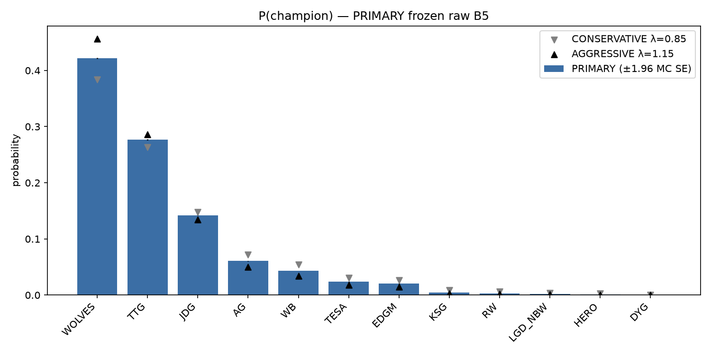
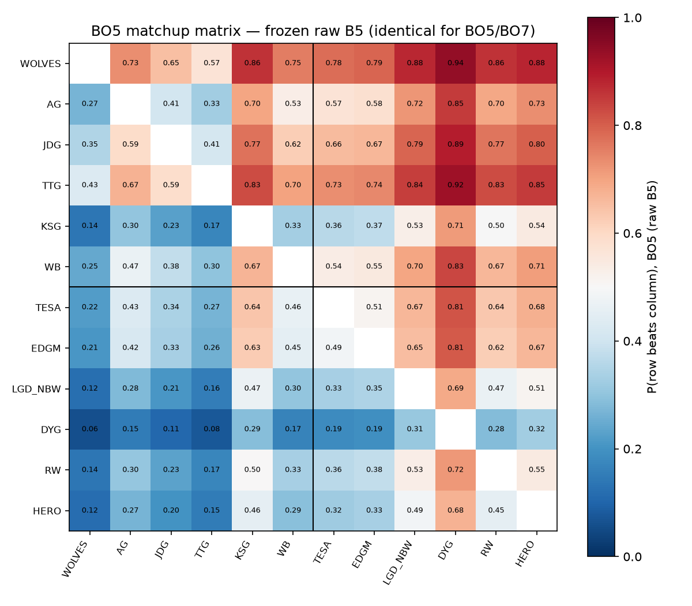
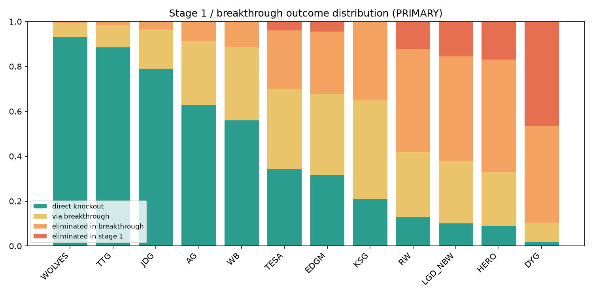
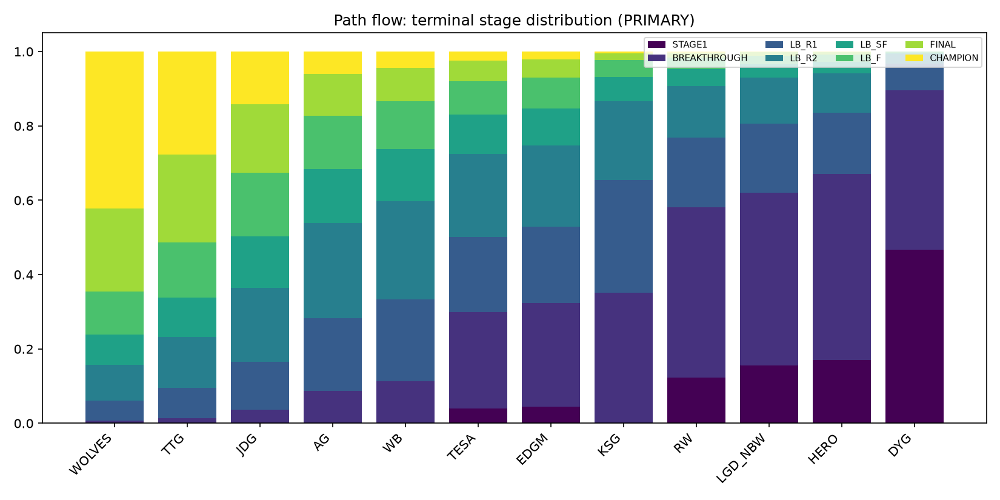
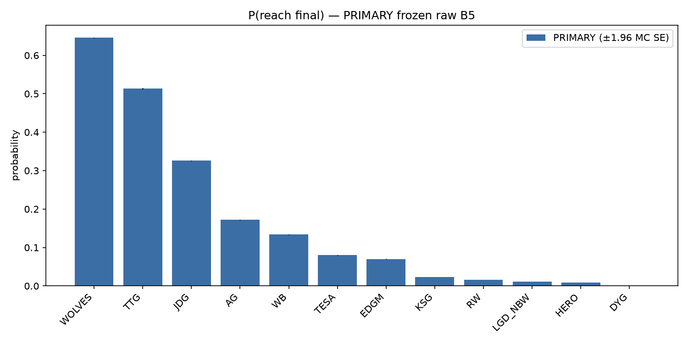
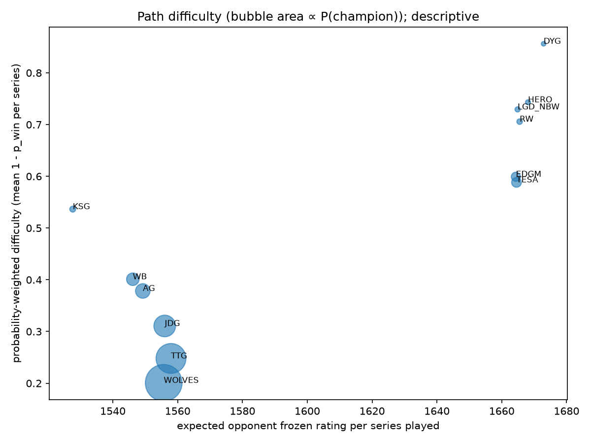
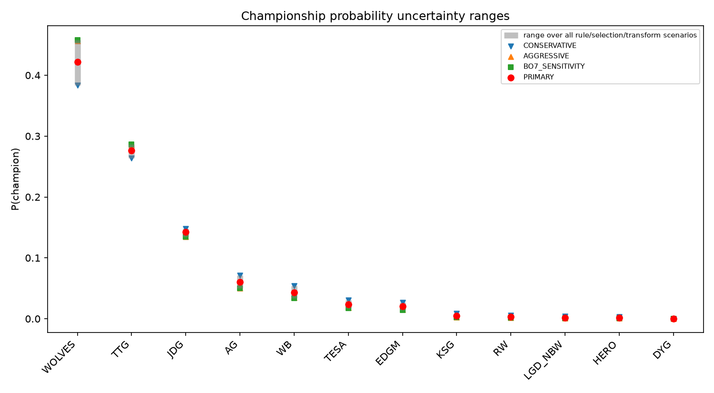
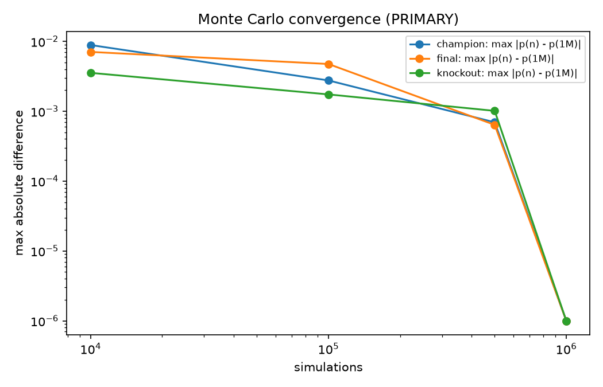

# 2026 KPL Annual Finals — Prospective Tournament Forecast (v1.0, PRE-TOURNAMENT FREEZE CANDIDATE)

- Generated 2026-09-29, before the first Annual Finals series on 2026-10-02.
- Information cutoff: 2026-09-28 00:00 Asia/Shanghai.
- PRIMARY = frozen raw B5, with the official format simulated 1,000,000 times.
- **Not frozen.** The freeze gate returned NOT_READY_TO_FREEZE (§13).
- All numbers come from `reports/tournament/*.csv`. MC SE ≤ 0.0005 for every probability below.

## 1. Executive summary

| team | group | B5 rating | P(knockout) | P(final) | P(champion) | conservative | aggressive | BO7 sens. |
|---|---|---|---|---|---|---|---|---|
| 重庆狼队 | Master | 1818 | 0.993 | 0.646 | **0.422** | 0.384 | 0.457 | 0.458 |
| 广州TTG | Master | 1771 | 0.986 | 0.514 | **0.277** | 0.264 | 0.286 | 0.286 |
| 北京JDG | Master | 1710 | 0.964 | 0.326 | **0.142** | 0.148 | 0.135 | 0.134 |
| 成都AG超玩会 | Master | 1644 | 0.913 | 0.172 | 0.061 | 0.072 | 0.050 | 0.050 |
| 北京WB | Master | 1622 | 0.886 | 0.134 | 0.043 | 0.054 | 0.034 | 0.034 |
| 长沙TES.A | Elite | 1597 | 0.701 | 0.080 | 0.024 | 0.031 | 0.018 | 0.017 |
| 上海EDG.M | Elite | 1589 | 0.677 | 0.070 | 0.020 | 0.027 | 0.015 | 0.014 |
| KSG | Master | 1498 | 0.649 | 0.023 | 0.005 | 0.009 | 0.003 | 0.003 |
| 济南RW侠 | Elite | 1501 | 0.419 | 0.016 | 0.003 | 0.006 | 0.002 | 0.002 |
| 杭州LGD.NBW | Elite | 1478 | 0.379 | 0.011 | 0.002 | 0.004 | 0.001 | 0.001 |
| 南通Hero久竞 | Elite | 1468 | 0.329 | 0.008 | 0.001 | 0.003 | 0.001 | 0.001 |
| 深圳DYG | Elite | 1341 | 0.105 | 0.001 | 0.000 | 0.000 | 0.000 | 0.000 |

- 重庆狼队 is the favorite, at about 42%. The three highest-rated teams together hold 84% of the title
  probability.
- Structure (group split, seeds, opponent selection, draw) shifts **championship** probabilities by at most
  0.4 points. It shifts **knockout-qualification** probabilities much more, by up to 20 points for KSG.
- No unresolved rule is material. The largest championship shift from any unresolved rule is 0.0037 (draw
  scenario K3, 重庆狼队), against the pre-registered threshold of 0.01.

## 2. Methodology

- **Strength:** B5 is replayed online over all 1,466 pre-cutoff series and then season-reset once
  (ρ = 0.9) for the Annual Finals. The result is frozen and hashed. P(i beats j) = 1/(1 + 10^((R_j − R_i)/400)).
  The same value is used for BO5 and BO7, and there is no updating within the tournament.
- **Stage 1 (擂台赛):**
  - 36 cross-group BO5 series; each group is ranked separately.
  - PRIMARY tiebreak T1: series wins, then game differential, then lot. The official rule is UNRESOLVED;
    alternatives are T2 (wins, then lot) and T3 (wins, game differential, then a strength-weighted playoff proxy).
  - Game scores are drawn from the constant per-game p implied by each series probability, so series outcomes
    stay exactly B5.
- **Breakthrough (突围赛):**
  - Master #5 picks first from Elite #2–#5, then Master #6 picks from the rest; the remaining two play each other.
    All three matches are BO7.
  - PRIMARY = OPTIMAL selection (the weakest legal opponent), because strategic choice is officially allowed.
- **Knockout (淘汰赛):**
  - The draw is simulated, never the realized bracket. PRIMARY draw K1: Master #1 and #2 go to opposite halves,
    the rest at random.
  - 8-team BO7 double elimination with the wiring in the config. Final on 2026-11-14 (BO7), with no carried
    advantage.
- **Scenarios:**
  - one million simulations each, sharing the seed (common random numbers);
  - MC SE is √(p(1 − p)/n);
  - materiality is |Δ| > 0.01 and |Δ| > 4 × combined SE (pre-registered).

## 3. Historical validation

v0.3 temporal benchmark, 1,330 out-of-time series:

| model | log loss | Brier | accuracy | AUC | calibration slope |
|---|---|---|---|---|---|
| B5 | 0.6256 | 0.2177 | 0.652 | 0.702 | 0.91 |
| coin flip | 0.6931 | 0.25 | — | — | — |

- F11 (2026S2) B5 predictions are reproduced exactly by the replay.
- v0.5 (player/roster), v0.6 (game, draft, series state) and v0.6.1 (BO7 slope) all failed to beat B5 out of
  time. See `FORECAST_MODEL_CARD.md`.

## 4. Team strength

| | Masters | Elite |
|---|---|---|
| top | 重庆狼队 1818, 广州TTG 1771, 北京JDG 1710 | 长沙TES.A 1597, 上海EDG.M 1589 |
| rest | 成都AG超玩会 1644, 北京WB 1622, KSG 1498 | 济南RW侠 1501, 杭州LGD.NBW 1478, 南通Hero久竞 1468, 深圳DYG 1341 |

- KSG is rated in the Elite band, and TES.A and EDG.M are rated at the level of the weaker Masters.
- Most lopsided pairing: 重庆狼队 vs 深圳DYG, 0.940. Closest: KSG vs 济南RW侠, 0.496.
- Full matrices: `bo5_matchup_matrix.csv` and `bo7_matchup_matrix.csv` (identical by construction; complement
  error ≤ 2.2e-16).

## 5. Stage 1 (擂台赛)

| team | E[wins]/6 | P(rank 1) | P(direct) | P(breakthrough) | P(eliminated) |
|---|---|---|---|---|---|
| 重庆狼队 | 5.13 | 0.396 | 0.930 | 0.070 | — |
| 广州TTG | 4.91 | 0.280 | 0.885 | 0.115 | — |
| 北京JDG | 4.58 | 0.165 | 0.790 | 0.210 | — |
| 成都AG超玩会 | 4.15 | 0.083 | 0.628 | 0.372 | — |
| 北京WB | 3.99 | 0.064 | 0.560 | 0.441 | — |
| KSG | 3.02 | 0.011 | 0.208 | 0.792 | — |
| 长沙TES.A | 2.37 | 0.344 | 0.344 | 0.617 | 0.040 |
| 上海EDG.M | 2.30 | 0.316 | 0.316 | 0.639 | 0.045 |
| 济南RW侠 | 1.69 | 0.130 | 0.130 | 0.747 | 0.123 |
| 杭州LGD.NBW | 1.54 | 0.101 | 0.101 | 0.744 | 0.155 |
| 南通Hero久竞 | 1.48 | 0.091 | 0.091 | 0.739 | 0.171 |
| 深圳DYG | 0.85 | 0.019 | 0.019 | 0.514 | 0.467 |

**Tiebreak audit** (`stage1_tiebreak_audit.csv`):
- Ties on series wins are the norm. At the consequential boundaries they occur 33–54% of the time, and in 96.4%
  of simulations at least one consequential boundary is tied.
- Game differential resolves most ties. The unknown final fallback is reached at a consequential boundary in
  33.8% of simulations.
- Yet the choice of tiebreak rule moves championship probabilities by at most 0.0010, final probabilities by at
  most 0.0026, and knockout qualification by at most 0.019 (KSG +0.019 under T2).
- The unresolved rule redistributes *who qualifies from ties*, mostly among teams far from the title.

## 6. Breakthrough (突围赛)

- **P(win breakthrough | enter):** 重庆狼队 0.90, 广州TTG 0.87, 北京JDG 0.83, 成都AG 0.77, 北京WB 0.74, KSG 0.56, 长沙TES.A
  0.58, 上海EDG.M 0.56, 济南RW侠 0.39, 杭州LGD.NBW 0.37, 南通Hero久竞 0.32, 深圳DYG 0.17.
- **Most likely first match (PRIMARY):** 北京WB vs 深圳DYG, 13.5% of simulations.
- **Most likely second match:** KSG vs 杭州LGD.NBW, 31.3%. KSG usually finishes Master #6 and picks after
  Master #5.
- **Selection sensitivity (`breakthrough_scenarios.csv`), for knockout qualification:**
  - Random choice instead of optimal: Masters −0.3 to −4.6 points (KSG −4.6); Elite teams gain up to +4.7
    (南通Hero久竞).
  - Adversarial choice: KSG −9.4, 北京WB −7.0, 南通Hero久竞 +17.7 points.
  - Championship probabilities move by at most 0.0033.
  - Opponent selection is therefore worth several points of *qualification* to the selecting Masters, and
    almost nothing at the title level.
- **Pool reading:** R10 (Elite #2–#5 only) vs "any remaining team" gives *identical* results under optimal
  selection, because no Master ever prefers to pick the other Master. Under random or adversarial behavior the
  two readings differ by at most 4.0 points of qualification.

## 7. Knockout (淘汰赛)

| team | P(upper SF) | P(upper final) | P(drop to lower) | P(lower final) | P(final) | P(champion \| knockout) |
|---|---|---|---|---|---|---|
| 重庆狼队 | 0.753 | 0.548 | 0.624 | 0.392 | 0.646 | 0.425 |
| 广州TTG | 0.689 | 0.452 | 0.726 | 0.402 | 0.514 | 0.281 |
| 北京JDG | 0.585 | 0.317 | 0.815 | 0.347 | 0.326 | 0.147 |
| 成都AG超玩会 | 0.459 | 0.198 | 0.838 | 0.241 | 0.172 | 0.066 |
| 北京WB | 0.415 | 0.164 | 0.829 | 0.205 | 0.134 | 0.049 |
| 长沙TES.A | 0.298 | 0.106 | 0.667 | 0.135 | 0.080 | 0.034 |
| 上海EDG.M | 0.278 | 0.096 | 0.647 | 0.123 | 0.070 | 0.030 |

- "Drop to lower" means the team loses at least one upper-bracket series.
- Draw scenarios, for championship probability: K2 (seeds only not paired in round 1) −0.0018; K3 (seeds face
  breakthrough winners in round 1) +0.0037. Both are for 重庆狼队 and both are immaterial.

## 8. Championship

- PRIMARY ranking: 重庆狼队 0.422, 广州TTG 0.277, 北京JDG 0.142, 成都AG超玩会 0.061, 北京WB 0.043, 长沙TES.A
  0.024, 上海EDG.M 0.020. The other five teams total 0.011.
- Final probabilities sum to 2 and champion probabilities to 1 (checked per simulation).
- Across all rule, selection and transform scenarios, 重庆狼队 ranges from 0.384 (conservative) to 0.458 (BO7
  sensitivity). The ranking of the top five never changes.

## 9. Matchups

- Masters are favored in 33 of 36 Stage 1 series (the exceptions are KSG vs TES.A, EDG.M and RW). The seven series where the Master's probability is at most
  0.55 are:

  | series | P(Master) |
  |---|---|
  | KSG–TES.A | 0.36 |
  | KSG–EDG.M | 0.37 |
  | KSG–RW | 0.50 |
  | KSG–LGD | 0.53 |
  | WB–TES.A | 0.54 |
  | KSG–Hero | 0.54 |
  | WB–EDG.M | 0.55 |

- All 36 Stage 1 probabilities are in `PREDICTION_LEDGER_2026.csv`. The BO7 values for any possible
  breakthrough or knockout pairing are in `bo7_matchup_matrix.csv`.

## 10. Structure effects (PATH ADVANTAGE / PATH COST / FORMAT EXPOSURE; descriptive, non-causal)

**REAL_FORMAT vs NEUTRAL_FORMAT** (NEUTRAL: 12-team BO5 round robin, top 8 into the same double elimination
with a random draw; `structural_value.csv`):

| | knockout | champion |
|---|---|---|
| KSG | +0.20 (0.649 vs 0.446) | +0.0015 |
| 深圳DYG | +0.05 | — |
| 长沙TES.A | −0.11 | −0.0041 |
| 上海EDG.M | −0.11 | −0.0034 |
| 重庆狼队 | — | +0.0025 |
| 广州TTG | — | +0.0021 |

- Masters play only Elite teams in Stage 1, and the weakest Masters get to pick breakthrough opponents.
  Strong Elite teams are the ones whose paths cost most.
- Title probabilities differ by less than 0.5 points for every team. At the top, the format mostly decides
  *who reaches the knockout*, not *who wins it*.

**Path metrics** (`path_metrics.csv`):
- Expected series played range from 6.8 (深圳DYG) to 10.3 (重庆狼队).
- FORMAT EXPOSURE (BO7 share of series played): 0.11 (DYG) to 0.42 (Wolves).
- Mean opponent rating per series: about 1,550 for Masters vs about 1,665 for Elite teams. Elite teams face the
  Masters in Stage 1.
- PATH ADVANTAGE (P(champion | direct) − P(champion | via breakthrough)):
  - 重庆狼队 +0.049, 广州TTG +0.044, 北京JDG +0.031;
  - ≤ 0.018 for everyone else.
- PATH COST (P(eliminated in breakthrough | entered)): 0.10 (Wolves) to 0.83 (DYG).

## 11. Sensitivity

**Uncertainty transforms**, p' = σ(λ·logit p). The spread is largest for the favorite, and the top-five ranking
never changes (`sensitivity.csv`):

| scenario | λ | 重庆狼队 P(champion) |
|---|---|---|
| CONSERVATIVE | 0.85 | 0.384 |
| AGGRESSIVE | 1.15 | 0.457 |
| BO7_SENSITIVITY | 1.161 on BO7 only (labeled sensitivity; rejected in v0.6.1) | 0.458 |

**Unresolved rules** (`materiality.csv`), all immaterial:

| rule | largest championship shift |
|---|---|
| R06 tiebreak | 0.0010 |
| R10 pool | 0.0000 |
| R13 draw | 0.0037 |

**Monte Carlo convergence** (`monte_carlo_convergence.csv`):
- The largest change from 500k to 1M simulations is 0.0010, within the 0.002 tolerance.
- An independent-seed 1M run differs by at most 0.0006 (champion), 0.0005 (final) and 0.0018 (knockout).
  All are within 2.7 SE.

## 12. Limitations

1. Frozen ratings for about 7 weeks, with no within-tournament learning.
2. BO7 treated like BO5 (the documented historical under-confidence is not corrected).
3. **Master 7-player rule not modeled.** Every Master must field all seven players in each Stage 1 BO5. In
   2026, 重庆狼队, 广州TTG and 北京JDG used exactly five players in every series; no Master used seven in more than
   one 2026 series (`master_rotation_readiness.csv`, DESCRIPTIVE — NOT USED IN PRIMARY FORECAST).
   - If the rule costs Masters strength, Stage 1 Master probabilities are overstated. This most affects the
     direct/breakthrough split for AG, WB and KSG.
   - It does not apply after Stage 1.
4. Loans and roster changes are ignored.
5. Structure partly unverified: tiebreak, seed-slot meaning, bracket wiring, breakthrough selection detail.
   All are shown to be immaterial for the championship, but they are not verified.
6. The OPTIMAL-selection assumption (rating-based) is an idealization.
7. One tournament provides little evidence either way.

## 13. Evaluation plan and freeze decision

- **Evaluation:** see `POST_TOURNAMENT_EVALUATION_PLAN.md` (pre-registered 2026-09-29). It scores the 36
  ledgered series, the conditional BO7 series, stage advancement and the championship. Artifacts are
  hash-verified first, and nothing is modified after outcomes.

**Freeze gate:**

| # | criterion | result |
|---|---|---|
| 1 | identities resolve | PASS |
| 2 | Stage 1 schedule verified | **FAIL**: pairings follow from the official rule, but the dates are a secondary transcription |
| 3 | advancement verified | **FAIL**: advancement slots are official, the ranking/tiebreak is UNRESOLVED |
| 4 | breakthrough selection verified | **FAIL**: selection is official, the pool detail is a secondary interpretation |
| 5 | draw/bracket verified | **FAIL**: seed-slot meaning unpublished, wiring secondary |
| 6 | no unresolved rule materially changes championship probabilities | PASS (max 0.0037) |
| 7 | tests pass | PASS (158/158) |
| 8 | locks pass | PASS (before run, after run, after tests) |
| 9 | Annual Finals outcomes absent | PASS |

**Decision: NOT_READY_TO_FREEZE.**
